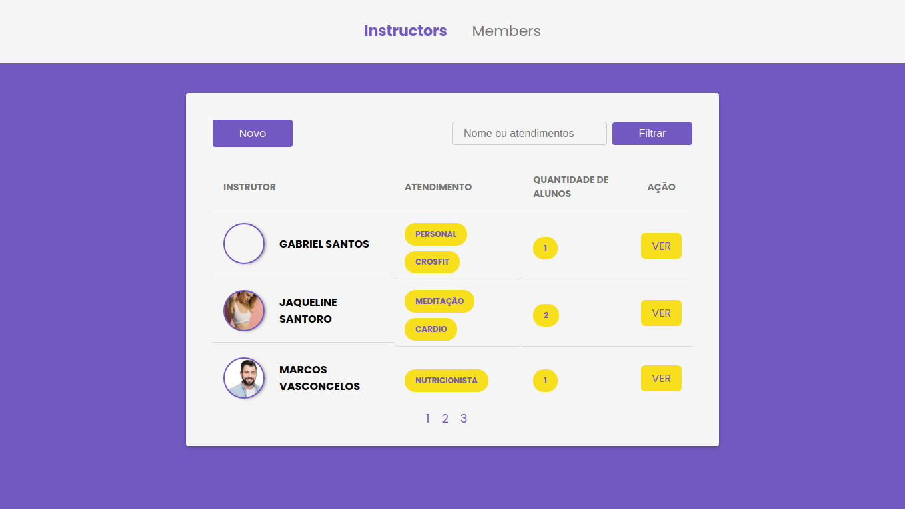
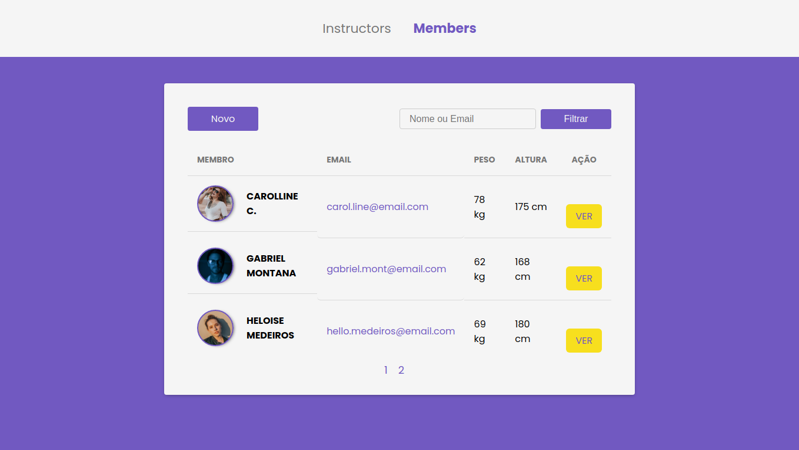

<h1 align="center">
    
</h1>

<h2 align="center">
  PROJETO: Gym Maneger
</h2>

    
  

  
  
  

Sistema web de gerenciamento de academia.

## Tópicos 

[Sobre o Gym Manager](#sobre-o-gym-manager)

[Funcionalidades](#funcionalidades)

[Tecnologias](#tecnologias)

[Licença](#licença)

 

## Sobre o Gym Manager

O Gym Manager é uma aplicação web de gerenciamento de academia, responsável pelo controle de instrutores e membros. Desenvolvido durante o bootcamp `LaunchBase` da [Rocketseat](https://rocketseat.com.br/). 

  

  

  

 

## Funcionalidades

- [X] Criar, visualizar, editar e apagar instrutores e membros.
- [X] Filtrar instrutores e membros.
- [X] Paginação.
- [X] Páginas dinâmicas com Nunjucks.
- [X] Banco de dados PostgreSQL.

 

## Tecnologias

As seguintes tecnologias foram utilizadas no desenvolvimento do projeto:

- [HTML](https://devdocs.io/html/)
- [CSS](https://devdocs.io/css/)
- [Javascript](https://devdocs.io/javascript/)
- [Node](https://nodejs.org/en/)
- [Express](https://expressjs.com/)
- [Nunjucks](https://mozilla.github.io/nunjucks/)
- [PostgreSQL](https://www.postgresql.org/)

 

 

## Licença

Esse projeto está sob a licença MIT. Veja o arquivo [LICENSE](/LICENSE) para mais detalhes.

---

### [Michael W. Lopes](https://github.com/michael23-lopes)